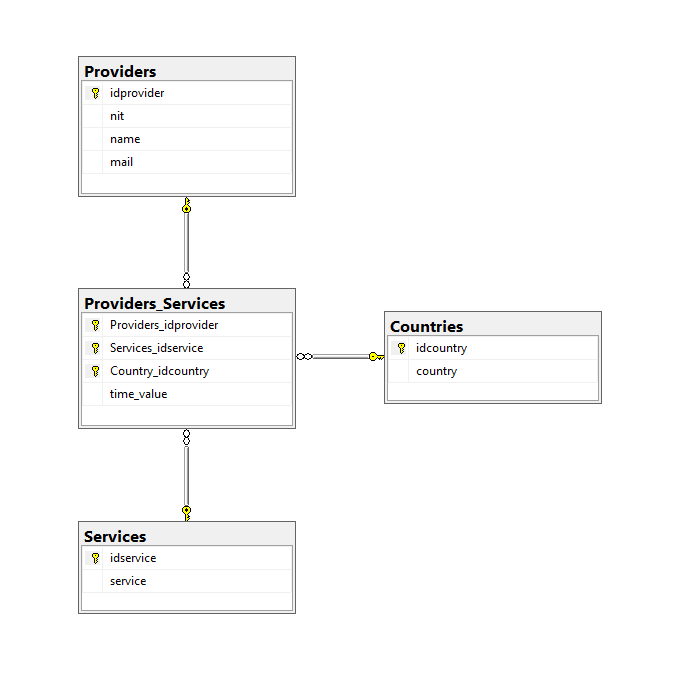

# PruebaTekus

## Descripción del Proyecto

La empresa **TEKUS S.A.S.** requiere un aplicativo web desarrollado en **.NET (ASP.NET Core)** que permita administrar los servicios ofrecidos por sus proveedores. La aplicación permite a los usuarios crear, editar y listar proveedores y los servicios asociados, además de gestionar los países en los cuales estos servicios son ofrecidos.

Cada proveedor debe estar relacionado con uno o varios servicios, y cada servicio, a su vez, puede estar asociado a uno o varios países. Por ejemplo, el proveedor "Importaciones Tekus S.A." podría ofrecer los servicios "Descarga espacial de contenidos" en Colombia, Perú y México, y "Desaparición forzada de bytes" en otros países.

### Requisitos del Proyecto

- **Proveedores:** Cada proveedor debe tener un ID, NIT, nombre y correo electrónico.
- **Servicios:** Cada servicio debe tener un ID, nombre y valor por hora en USD.
- **Relaciones:** Un proveedor puede ofrecer múltiples servicios, y cada servicio puede ser ofrecido en múltiples países.
- **Autenticación:** La aplicación debe incluir un mecanismo de autenticación, aunque no es necesario desarrollar funcionalidades de gestión de usuarios.
- **Campos Personalizados:** Los usuarios pueden agregar campos personalizados a cada proveedor.
- **Resumen de Indicadores:** La API debe proveer un endpoint que entregue un resumen con indicadores importantes, como la cantidad de proveedores por país y la cantidad de servicios por país.
- **API RESTful:** Todos los servicios deben ser expuestos a través de una API RESTful.
- **Paginación, Ordenamiento y Búsqueda:** Las listas de datos deben soportar estas funcionalidades.
- **Validaciones:** Se deben agregar todas las validaciones necesarias para asegurar el correcto formato de los datos.
- **Pruebas Unitarias y de Integración:** Se deben construir pruebas dirigidas exclusivamente al backend.
- **Scripts de Base de Datos:** Se debe proporcionar un script para la generación de la base de datos, así como un script con datos iniciales (mínimo 10 registros por tabla).

## Modelo Entidad-Relación

El siguiente diagrama representa el Modelo Entidad-Relación (MER) de la base de datos utilizada en PruebaTekus:



## Configuración de la Base de Datos

### 1. Configuración del archivo `appsettings.json`

Para crear la base de datos, es necesario configurar la cadena de conexión en los archivos `appsettings.json` y `appsettings.Development.json`. Asegúrate de que la configuración sea similar a la siguiente:

````bash
"conexion": "Server=localhost,1433;Database=DBPruebaTekus;TrustServerCertificate=true;Trusted_Connection=True;"
````

## 2. Creación de la Base de Datos

Después de configurar la cadena de conexión, navega a la ruta del proyecto en la consola:

````bash
PruebaTekus\PruebaTekus.Infrastructure>
````

Ejecutan el siguiente comando

```bash
dotnet ef database update
```

Ese comando lo que hace es crear la bd con la configuración que tiene la migración que ya está creada

## Ejecución del proyecto

Abrimos la consola y vamos a la ruta del webApi y ejecutamos el siguiente comando

```bash
PruebaTekus\PruebaTekus.WebApi> dotnet build
```

Luego de haber compilado ejecutamos el siguiente comando

```bash
PruebaTekus\PruebaTekus.WebApi> dotnet run --launch-profile https
```

### Tecnologías y Arquitectura Usadas

El proyecto **PruebaTekus** ha sido desarrollado utilizando un conjunto de tecnologías modernas y sigue una arquitectura bien estructurada para garantizar la escalabilidad, mantenibilidad y facilidad de pruebas. A continuación se describen las tecnologías y la arquitectura utilizada en el proyecto:

#### Tecnologías Utilizadas

- **.NET Core / ASP.NET Core**: Framework principal para la construcción de la aplicación web. Se utiliza para desarrollar la API RESTful que maneja las operaciones CRUD para proveedores y servicios.
  
- **Entity Framework Core**: ORM (Object-Relational Mapper) utilizado para manejar la persistencia de datos y realizar las operaciones en la base de datos SQL Server.

- **SQL Server**: Sistema de gestión de bases de datos relacional utilizado para almacenar los datos de los proveedores, servicios, y las relaciones entre ellos.

- **JWT (JSON Web Tokens)**: Implementado para manejar la autenticación segura de usuarios en la API.

- **Swagger**: Utilizado para la documentación automática de la API, facilitando así la interacción con los diferentes endpoints.

- **xUnit**: Framework de pruebas utilizado para escribir y ejecutar pruebas unitarias y de integración.

- **Postman**: Utilizado para probar manualmente los endpoints de la API y verificar su correcto funcionamiento.

- **Visual Studio Code**: Entornos de desarrollo utilizados para la escritura, compilación y depuración del código.

#### Arquitectura Utilizada

- **Arquitectura en Capas (Layered Architecture)**:
  - **PruebaTekus.Domain**: Esta capa contiene las entidades de dominio y las interfaces de repositorios. Define la lógica de negocio y las reglas que gobiernan la aplicación.
  - **PruebaTekus.Application**: Implementa los servicios de aplicación que interactúan con los repositorios. Aquí se maneja la lógica de negocio más compleja y se orquestan las operaciones de la aplicación.
  - **PruebaTekus.Infrastructure**: Contiene la implementación de los repositorios, el contexto de la base de datos, y las migraciones de Entity Framework Core. Esta capa interactúa directamente con la base de datos.
  - **PruebaTekus.WebApi**: Proyecto principal que expone los servicios a través de una API RESTful. Maneja las solicitudes HTTP y utiliza los servicios de la capa de aplicación.
  - **PruebaTekus.Tests**: Contiene todas las pruebas unitarias e integrales para asegurar que la aplicación funcione correctamente y según lo esperado.

- **Patrón de Diseño DDD (Domain-Driven Design)**: La aplicación sigue principios de DDD para estructurar el código y modelar las entidades de dominio, lo que asegura una clara separación de preocupaciones y facilita la evolución del código con el tiempo.

- **Inyección de Dependencias (Dependency Injection)**: Utilizada ampliamente en todo el proyecto para gestionar la creación y resolución de dependencias, promoviendo el desacoplamiento y facilitando las pruebas.

Este enfoque arquitectónico garantiza que la aplicación sea modular, testeable y fácil de mantener, al mismo tiempo que asegura que las funcionalidades requeridas se implementen de manera robusta y eficiente.
